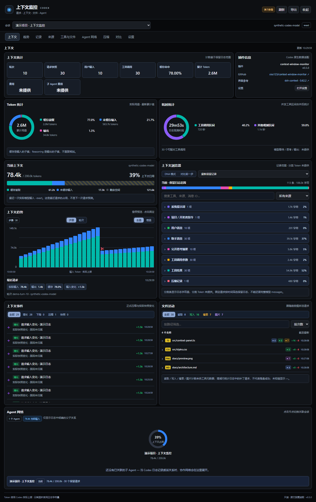

# Codex 上下文监控插件

`context-window-monitor` **0.5.0**，用于 Codex Desktop / CLI。依据 [dsh-context 0.62.2 源码](https://github.com/bowenliang123/dsh-context/tree/42f84915617705ccd4f1f9a0112bd5113b6089fd) 重做的黑色上下文仪表盘，自动适配 Codex 中注册的所有本地项目。它是 Codex 插件，不依赖 DeepSeek Harness。

[下载 v0.5.0](https://github.com/xlxs123/context-window-monitor/releases/tag/v0.5.0) · [许可证](LICENSE) · [上游源码适配](docs/dsh-source-adaptation.md) · [验证记录](docs/verification.md)

## 一键打开

Windows 安装后，按 **Ctrl+Alt+M**（被占用时尝试 **Ctrl+Alt+Shift+M**），或左键点击**任务栏右下角、时钟附近的上下文监控托盘图标**，即可在 **Codex 内置浏览器**打开仪表盘。图标是绿色圆环和白色柱形图，悬停显示「上下文监控」和实际注册的快捷键；被 Windows 折叠时，在通知区域的 `^` 中查找。无需聊天指令，不调用模型，不逐个项目配置。

这是所有安装用户共享的默认行为，不是本机特定修改。启动器使用 `codex://` 浏览器协议，不绑定用户名、盘符、Desktop 安装目录或版本号。Windows Store 安装会自动读取当前安装包的 manifest，定位实际程序并传入链接，兼容系统协议激活丢失参数的情况；其他安装使用注册的协议入口。服务从各自的 `CODEX_HOME` 获取数据，并自动跟随注册项目。不同电脑各自创建本机服务和访问地址。

这个入口是插件自己的 Windows 托盘按钮，**不是 Codex 聊天菜单或摘要面板里的按钮**。旧版只验证了项目操作配置和启动命令，未验证按钮显示；用户截图确认当前页面未显示项目操作，因此 0.4.2 不再依赖它作为主入口。

Windows 首次使用：

1. 安装 Codex Desktop 和 Node.js **22.13 或更新版本**。
2. 下载 Release 的 ZIP，完整解压，双击 **`Install.cmd`**。
3. 安装器会检查托盘启动和快捷键注册。安装后直接按 **Ctrl+Alt+M**；被占用时自动尝试 **Ctrl+Alt+Shift+M**。安装器和图标悬停会显示实际组合；都被占用时仍可点击托盘图标。

安装器会注册个人插件市场、安装启用插件，并立即启动托盘和自动接入。通过其他方式安装插件时，自动接入和登录恢复在 Codex 首次加载插件的 MCP 服务后注册；宿主尚未加载时需要重新打开 Codex。打开监控不要求 PATH 中存在 `codex`，不需要 Python。托盘不读取或控制其他应用窗口，不占用前台；退出托盘后，下次插件加载会重新启动。设置 `CONTEXT_MONITOR_DISABLE_DESKTOP_ENTRY=1` 可关闭托盘自动启动。

**Windows 登录恢复**：0.4.4 起，安装或首次 MCP 加载会创建当前用户的 `CodexContextMonitor` 启动项，重新登录后自动恢复托盘和快捷键，不需要先发送聊天指令。启动前动态查询 Codex 的实际安装和启用状态；禁用或卸载后，下次登录不启动监控。现有运行中的服务可通过托盘菜单退出，或用下方停止命令关闭。每次登录重新定位当前 CLI 和插件版本，避免 Store 升级、缓存更新后路径失效。用户主动停用 Windows 启动项时不会重新开启它。

启动项位于 `HKCU\Software\Microsoft\Windows\CurrentVersion\Run`，无需管理员权限。稳定脚本和参数位于 `%LOCALAPPDATA%\OpenAI\CodexContextMonitor`；参数通过 JSON 保存，短启动命令遵守 [Windows Run 的长度限制](https://learn.microsoft.com/windows/win32/setupapi/run-and-runonce-registry-keys)。普通诊断写入 `CODEX_HOME/context-window-monitor/startup-last-run.json`，参数损坏时写入稳定脚本旁边。同名启动项或脚本的用户修改会保留并报错。

仅关闭登录恢复可在安装和加载插件前设置 `CONTEXT_MONITOR_DISABLE_LOGIN_STARTUP=1`。移除已注册启动项可执行 `powershell -NoProfile -ExecutionPolicy Bypass -File "C:\path\to\context-window-monitor\scripts\configure-startup.ps1" -Mode Remove`；脚本只移除它自己创建且未被修改的启动项。保持上述环境变量可避免后续加载重新注册。登录恢复不承担运行中崩溃后的持续重启。

自动接入每 3 秒读取 Codex 当前项目注册表。已有项目、新增项目和路径变化都会处理；移除项目后清理插件自己添加且未被用户编辑的入口。不扫描磁盘、不使用已删除项目的历史列表。仅支持本机可写的项目目录；ChatGPT 云端项目不属于此入口的范围。

可选的项目操作配置使用 Codex 官方支持的 [本地环境操作](https://learn.chatgpt.com/docs/environments/local-environment)。插件在项目主根目录的 `.codex/environments/*.toml` 中维护标记块；没有配置时生成 `environment.toml`。保留已有 setup、其他操作和注释，修改前备份到 `CODEX_HOME/context-window-monitor/project-action-backups`。配置损坏、外部路径链接、用户修改的标记块会保留并报告，避免覆盖。

项目操作是否显示取决于 Codex 版本、项目状态和当前界面，**生成配置不代表界面上一定出现按钮**。

多个聊天和重复点击共享一个隐藏的本机服务和一个托盘。关闭页面后不再主动刷新日志，项目列表仍会同步。`scripts/open-dashboard.ps1 -Stop` 可停止服务和托盘；下次插件加载会再次启动。托盘右键菜单可单独退出托盘。`CONTEXT_MONITOR_DISABLE_AUTO_PROJECTS=1` 可关闭自动接入。开发时可运行 `npm run open`；`--ensure` 只启动服务和接入，不打开浏览器。

托盘和快捷键选择**本机最近活动的会话**，自动覆盖不同项目；无法识别只切换但尚未产生活动的聊天。可选项目操作不提供当前选中聊天的 ID，因此按工作目录选择**本项目最近活动的会话**，并在页面明确提示；可以通过 SESSION 切换。没有匹配时显示无数据，不跳到其他项目。程序支持 `node runtime/open-dashboard.mjs --session <session-id>` 精确打开指定会话；`--no-open` 只输出地址与启动耗时，供验证使用。

## 源码适配后的界面



按上游的统计与插件信息、Token 与耗时、左侧容量与趋势 / 右侧浏览器、事件与文件活动、Agent 网络排列。保留 Codex 托盘、快捷键和内置浏览器入口。

## 已实现

- 黑色双列总览：统计卡片、输入/输出环图、当前容量、增长柱状图、分类记录浏览器、近期事件、长内容列表、Agent 网络。
- Codex 实际 Token：最近模型输入、窗口容量、剩余量、缓存读取/写入、输出、Reasoning 输出及累计消耗。
- 步骤 / 轮次、全量 / 增量切换；悬停预览、点击固定，浏览器和文件列表随所选请求联动；同会话或跨会话用量对比。
- DNA 视图按日志顺序展示记录字符量，支持来源筛选、检查和相对前一步新增记录。
- 日志来源分类、工具调用与返回关联、读取 / 写入 / 搜索 / 图片筛选、文件路径搜索及排序、Top 5/10/20 长记录。
- 多文件标准 `apply_patch` 请求的增减行统计；未知数量留空，不把工具结果重复计作文件操作。
- SHA-256 完全重复长内容检测；字符数只表示文本长度，不转换为 Token。
- 正式压缩事件识别，包括新版 `compacted`；查看前后真实请求输入快照。
- 历史/近期 Session 选择；以明确 `parent_thread_id` 展示父子 Agent 关系并跳转。
- Inspector：类型、角色、时间、消息/调用 ID、字符数、路径；原文默认隐藏，需启用并主动读取单条记录。
- 手动 JSON 报告导出、选中记录导出、暂停刷新、紧凑模式、窄屏布局。

## 直接运行

发布包包含编译好的 `runtime/`，安装 Node.js 22.13+ 后无需先安装 npm 依赖：

```powershell
cd "C:\path\to\context-window-monitor"
node runtime/dashboard.mjs
```

终端会输出随机端口的 `http://127.0.0.1:.../随机路径/`。打开这个**完整地址**即可。可显式指定 Codex 会话：

```powershell
node runtime/dashboard.mjs <session-id>
```

服务仅监听本机回环地址，不调用模型、不需要 API key。关闭进程即停止仪表盘。默认读取本机 `CODEX_HOME/sessions`（未设置时为 `%USERPROFILE%\.codex\sessions`）。

## 作为 Codex 插件使用

插件包含 `.codex-plugin/plugin.json`、`.mcp.json`、`hooks/`、`skills/` 和已打包的 MCP 服务。

默认插件选择器为 `context-window-monitor@personal`。双击 `Install.cmd` 可首次安装或更新到 **0.5.0**，旧版本保留备份。

也可在 PowerShell 执行下面一行。脚本检查环境，备份旧版，注册市场、更新缓存、验证版本并启动自动接入；兼容 Windows PowerShell 5.1：

```powershell
powershell -NoProfile -ExecutionPolicy Bypass -File "C:\path\to\context-window-monitor\scripts\install-local.ps1"
```

只检查环境而不安装时，在末尾加 `-CheckOnly`。无需管理员权限；执行策略选项只作用于这次脚本进程。解压包位于其他目录时，将 `-File` 后的路径改为实际脚本路径。

普通 PowerShell 的 `PATH` 可能找不到 `codex`。安装脚本会优先使用已有命令，否则在 `%LOCALAPPDATA%\OpenAI\Codex\bin` 的版本目录中定位 `codex.exe`，以完整路径调用；不会修改系统 PATH。只需 Node.js，无需 Python 或 Codex 内部的安装助手脚本。安装副本会使用唯一版本后缀刷新缓存，源码版本保持不变。

运行副本位于 `%USERPROFILE%\plugins\context-window-monitor`。安装器按 [官方插件格式](https://developers.openai.com/plugins/build/plugins) 创建或补充个人市场条目，保留已有其他插件并备份市场文件；已有同名条目指向别处时停止并说明，不覆盖它。Node.js 最低版本用于内置的只读 SQLite 项目发现，无需额外安装数据库或 npm 依赖。

配置完成后即可使用托盘或快捷键。如果需要让模型分析数据，也保留了 **“打开上下文监控”** 指令：新聊天加载更新后的技能后，可调用 `show_context_monitor`，并在支持 `open_in_codex` 的宿主中打开返回的本地仪表盘地址。支持 MCP Apps 的宿主也能渲染同一界面。

Windows 主入口为插件托盘和快捷键；项目操作为可选入口，不修改 Codex 程序文件。macOS / Linux 没有这项 Windows 托盘功能，可使用本地启动器或宿主支持的项目操作。启动器默认通过 `codex://browser?url=<完整地址的编码值>` 打开当前聊天的内置浏览器，不创建聊天、不发送指令。该浏览器路由已核对 Codex Desktop 26.928 的实际解析器和处理代码；官方公开的深链列表尚未列出它，其他版本需实际验证。只有 CLI、未安装 Desktop 或版本不支持时，可主动使用 `--external-browser`（PowerShell 包装器为 `-ExternalBrowser`）打开系统浏览器，启动器不会自动切换。CLI 也可用 `--no-open` 仅返回地址。自动接入不依赖 hooks 的信任状态；hooks 如需启用，请通过 Codex 的 `/hooks` 审核。

## 数据口径与边界

| 指标 | 实现与精度 |
|---|---|
| 当前占用 | 最近一次模型调用的 `input_tokens`，Exact；不是下一次请求的预测 |
| 窗口容量 | Codex 实际报告的 `model_context_window`；缺失为 Unavailable |
| 剩余量、占用率 | 对实际数值计算，不硬编码模型容量 |
| 缓存 | 输入的子集，不再加到 input 上 |
| Reasoning | 输出的子集，不再加到 output 上；不解密隐藏内容 |
| 累计消耗 | 独立显示，不当作当前窗口占用 |
| 耗时 | 保留日志的时间跨度；明确 call_id 配对的调用至结果区间，并发区间合并；模型等待 / 思考 / 输出用时未提供 |
| 文件活动 | 只解析显式结构化路径和标准补丁头；不猜测 Shell / JavaScript 中的文件访问。增减行表示补丁请求，不证明实际落盘 |
| 日志分类、工具次数、字符数 | 只针对保留的日志范围，不声称仍全部处于模型上下文 |
| 分类 Token、完整模型 messages、子 Agent 结果 Token | 当前无法可靠获得，明确显示 Unavailable |
| 压缩节省量 | 正式事件两侧的请求输入差值；期间新增消息也会影响差值 |
| 重复检测 | 公开文本完全相同且至少 256 字符；不推断语义相似或历史价值 |

首次最多读取 2 MiB 日志尾部，此后只读新增字节。保留 80 个用量快照、500 条记录、20 个压缩事件；最多缓存 12 个会话。截取状态在页面可见。早于范围的压缩可能不显示；不会编造缺失的前后数据。

若未指定 Session，也没有可信 hook，使用最近日志回退，明确提示会话匹配需要确认。近期 Session 发现扫描最近两个年份中最近三个月、每月最近十四个日志日期目录；已注册的历史 Session 仍可直接打开。

## 核心数据流

```text
Codex hooks → SessionRegistry（定位与事件元数据）
                     ↓
Codex rollout → 有界增量读取 → 用量 / 事件 / 活动元数据
                     ↓
ContextMonitorService → MCP 工具 + 本机 HTTP 仪表盘
                     ↓
黑色总览 / Inspector / 趋势 / 工具 / 压缩 / 快照对比
```

`read_context_item` 只按已经观察到的记录 ID 回读该行的公开文本；不接受任意文件路径，不读取环境变量或凭据文件。

## 工程文件

- 新增 `src/providers/activity-tracker.ts`：结构分类、工具关联、重复检测、文件参数统计。
- 新增 `src/dashboard-server.ts`、`src/dashboard.ts`：本机仪表盘入口和访问边界。
- 新增 `src/ui/styles.ts`，重写 `src/ui/context-details-panel.ts`：黑色界面和交互。
- 扩展 `src/providers/rollout-event-parser.ts`、`rollout-context-provider.ts`：新版事件、增量读取、Session 发现、按需原文。
- 更新 `context-types.ts`、`context-monitor-service.ts`、`context-history-tracker.ts`、`context-usage-service.ts`、`mcp-server.ts`、`index.ts` 和构建脚本。
- 更新插件 manifest、技能、文档、预览；新增活动测试并扩展 MCP 集成测试。
- `runtime/` 是已编译的交付产物；测试、预览和验证依赖不进入插件运行包。

## 验证与开发

```powershell
npm ci
npm run check
npm run preview
```

重新打包：完成 `npm run check` 后运行 `python scripts/package.py`。产物为 `dist/context-window-monitor-0.5.0.zip` 及 SHA-256 校验文件，包含源码和编译好的运行文件。第三方许可证保留在 `docs/THIRD-PARTY-NOTICES.md`。环图几何算法适配自 dsh-context，使用 Apache-2.0；完整许可证与修改归属随包附带。

预览为 `http://127.0.0.1:4174`，明确标为**演示数据**，不会读取真实会话原文。`npm run dashboard` 才读取本机真实 Codex 数据。

已完成的验证见 [验证记录](docs/verification.md)；数据源与扩展边界见 [数据来源](docs/data-sources.md)。

隐私：元数据只在本机读取，原文不自动返回、持久化或导出。仪表盘使用随机访问路径并验证 Host/Origin，无外部网络依赖。报告可能包含模型、会话 ID、工具名和日志中明确记录的文件路径；导出由用户主动触发。
